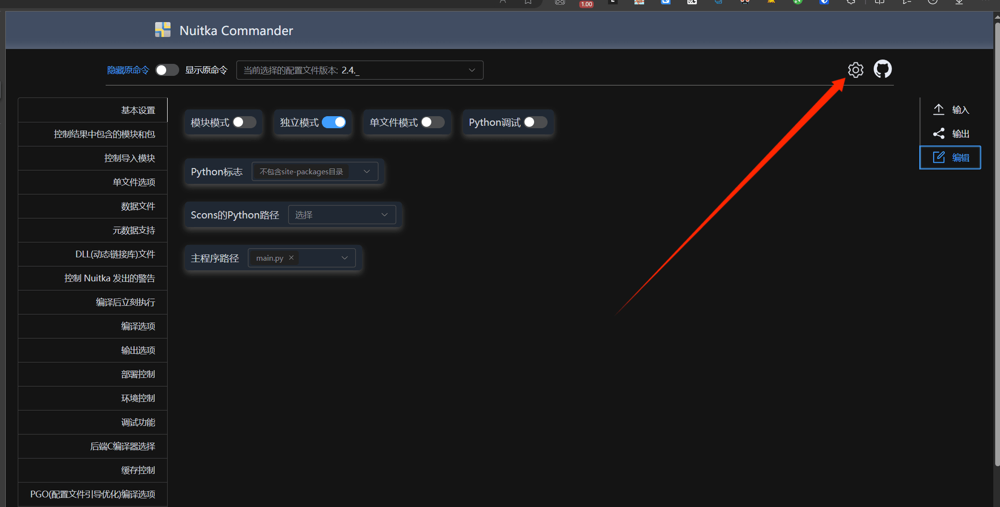
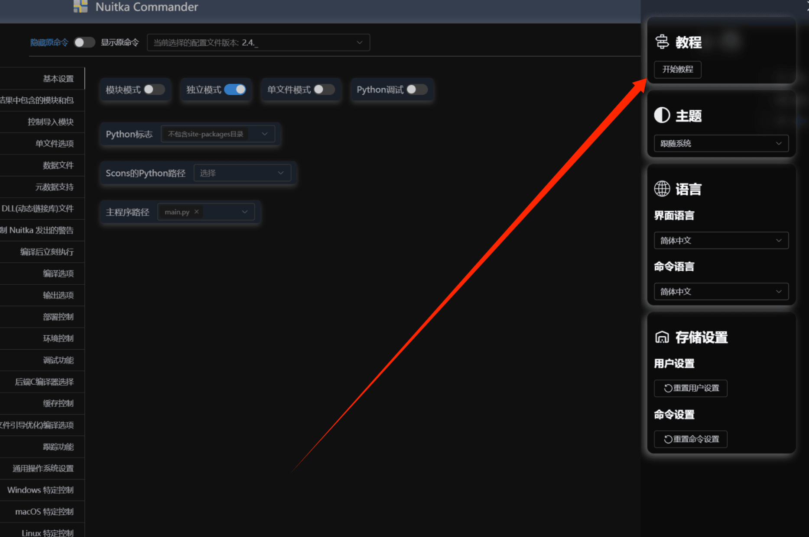

# Nuitka-Commander

## 概述

这是一个WEB项目，用于简化使用[Nuitka](https://nuitka.net)中配置打包命令的过程、提供快捷方便的命令选择。  
它有着如下的优势:

- 基于网页，极强的跨平台性
- 可下载到本地使用，无需联网
- 提供多种语言的支持
- 提供多种Nuitka版本的支持
- 配置和渲染分离，易于维护和扩展

## 使用

### 通过网页使用

最方便的方式是直接使用在线的网页，这样您同时可以获得最新的版本支持和语言支持。您可以从以下网址访问:  
[在网页上使用Nuitka Commander](https://nuitka-commander.erduotong.com)

### 下载到本地使用

如果您仍然希望在本地使用，那么我们也提供了单个的html文件以供使用(非Electron)  
您可通过该文件使用在该版本下和网页版完全一致的功能。  
请从 -> [Release](https://github.com/Nuitka-Commander/nuitka-commander.github.io/releases/latest) <-
界面下载`Nuitka-Commander.html`到本地，随后通过浏览器打开该文件以使用。

### 开始使用

首先，请打开网页或下载到本地的`Nuitka-Commander.html`文件。`推荐使用Chrome/Firefox/Edge浏览器`  
一般来说，若您的浏览器的语言是符合您的习惯的，那么网页会自动切换到您的语言(若已支持）。  
接下来，你可以进入设置页面，随后查看教程

## 帮助我们完善

Nuitka Commander是一个开源项目，遵循[GPL v3](./LICENSE)开源协议开源。如果您希望Nuitka Commander更加完善，我们十分欢迎您一起贡献代码，使Nuitka
Commander更加完善，例如更多的语言支持或更多的Nuitka版本支持。    
如果您有意愿，请点击 -> [开发文档](./docs/get_involved.md) <- 以获得更多文档

## 开源协议

遵循[GPL v3](./LICENSE)

